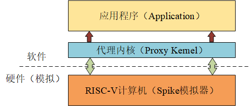

## 前言

本书的写作目标是围绕基于RISC-V的代理内核（Proxy Kernel），设计和指导读者完成一组实验作为《操作系统原理》课程的课程实验以及课程设计内容。课程实验的内容需要学习《操作系统原理》课程的读者独立完成，课程设计的内容则鼓励有条件的读者多人合作完成。我们希望通过本书所设计的实验，加深读者对原理课程所授知识的理解。

**操作系统的本质，是介于硬件和用户软件（应用）之间的一个大型软件系统，通过对硬件的包装来支撑应用的运行**。这一点，在代理内核（Proxy Kernel）上体现得尤为明显：它的作用是为应用提供最基本的操作系统支撑，使其能够在裸机（在实验中，我们采用的是Spike模拟器）上运行。正是由于这一特点，代理内核可以看成是操作系统的一个极小子集（对于代理内核的详细讨论，参见[1.6](chapter1.md#proxykernel)）。在采用代理内核的场景下，计算机的软硬件界限以及代理内核的地位如图1.1所示。

                               

图1.1 计算机的软硬件界限以及代理内核在计算机中所处的地位

在本书所设计的实验中，我们选择的“裸机”是一个基于精简指令集（RISC）的RISC-V计算机，该计算机所支撑的指令集为RV64G（支持RISC-V的通用标量指令集以及浮点等诸多扩展）。我们在实验中采用了Spike模拟器来模拟RISC-V计算机的行为，Spike模拟器是RISC-V生态中重要的硬件模拟器，它通过软件的办法忠实地“复现”了硬件的行为。相较于在真正的物理机器上开发操作系统，采用模拟器开发操作系统实验具有环境搭载方便，便于调试等优点。

本书设计的实验并未采用完整操作系统内核的方案，这是因为如果采用完整内核的思路来设计实验，非常容易陷入某个模块（如启动、中断处理、内存管理、进程调度、设备管理、文件系统、Shell等等）的设计细节，整个过程虽然也会用到一些应用来验证，但设计的重点始终是操作系统本身。完整方案中，即使是为了运行一个最简单的Hello world！程序，都需要实现如用户态进程封装、进程调度等以及之前的一系列操作系统模块（如启动、中断处理、内存管理等），这样做反而忽略了操作系统对硬件进行封装以支撑应用运行的本质！同时，为了更“像”一个完整的操作系统，完整操作系统内核实验方案往往需要自己“发明”一个简单文件系统，并用它来组织虚拟磁盘（一般是用一个文件来模拟），这样就不得不引入大量与应用支撑无关的代码，导致了工程庞大和重点不突出等诸多问题。

代理内核方案避免了完整内核方案以上的很多缺点，因为代理内核的存在“天生”就是为在硬件（模拟器）上支撑应用，而设计的最小化的操作系统内核。**它可以根据应用的复杂度的不同，调整自身的复杂度**：例如，如果只是为了支撑Hello world！程序，它就只需要加载、系统调用支持即可，无需进程调度、设备、文件，甚至虚拟存储等等内容。当然，如果所支撑的应用非常复杂（例如，一个多线程的网络媒体服务器），代理内核将约等于一个完整的操作系统内核！**从学习操作系统知识的角度来看，代理内核的这些特点更有利于读者站在应用的角度来审视操作系统对硬件的包装和为应用所做的支撑，从而更好地理解从原理课程所学到的知识**。也正是代理内核的这些优点，驱使我们在RISC-V Proxy Kernel and Boot Loader这个开源项目[ProxyKernel](#references)的基础上，开发并设计了本书的一组操作系统实验。为了与开源项目进行区分，在本书中，我们将称我们开发和设计的代理内核为PKE（Proxy Kernel for Education）。

为完成本书所设计的实验，读者应具备汇编语言、C语言、基础的计算机体系结构知识、Linux环境中的基础软件（如编译器、常见命令，以及git工具等）的使用，这些基础知识。考虑到《计算机组成原理》课程与《操作系统原理》课程在开课时间上可能的重叠，以及RISC-V汇编语言和8086汇编语言的巨大不同，我们将在第一章介绍RISC-V计算机的体系结构的相关知识。从第二章开始，我们将开始介绍PKE的实验。在完成PKE的5个实验后，本书的第七章将给出操作系统课程设计题目。

 

参考文献：

[ProxyKernel] RISC-V Proxy Kernel and Boot Loader. https://github.com/riscv/riscv-pk

 